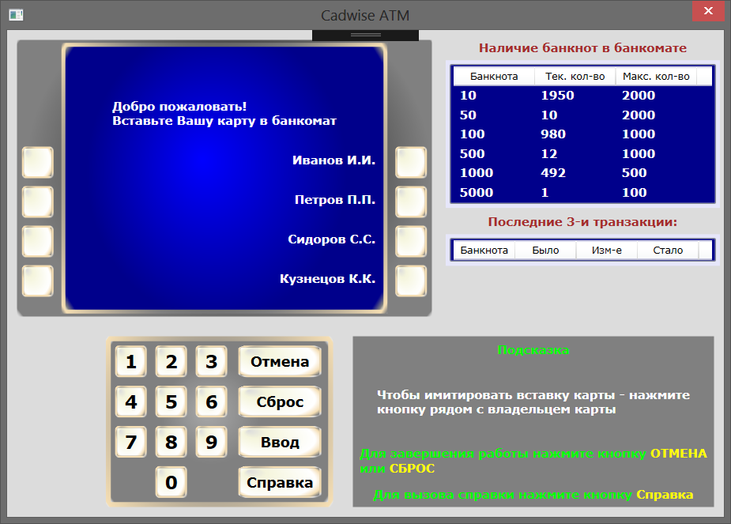
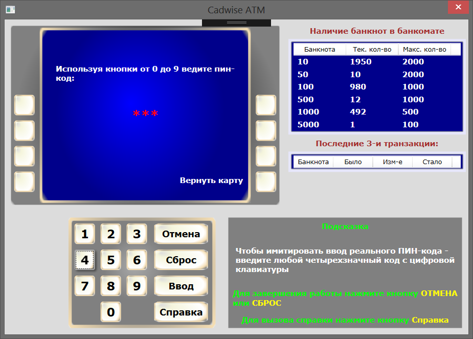
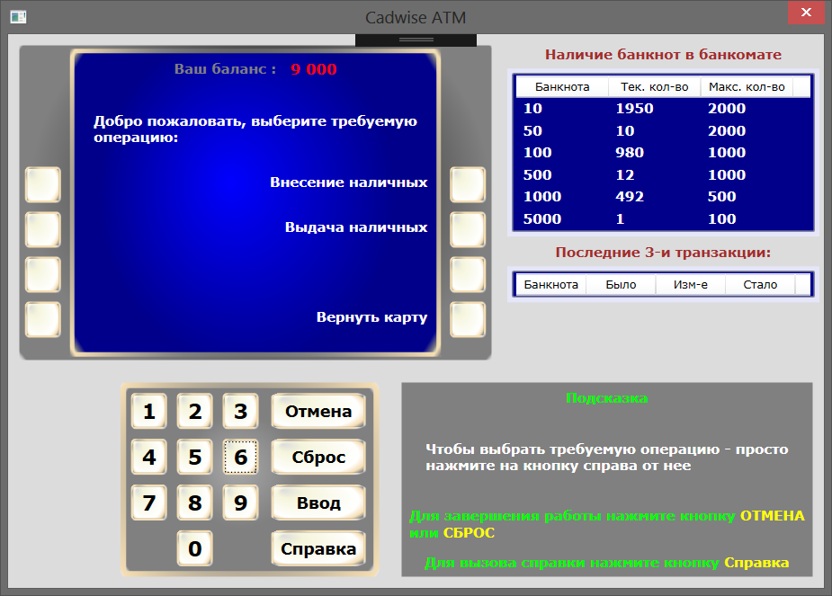
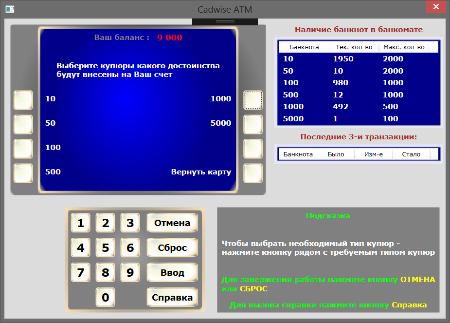
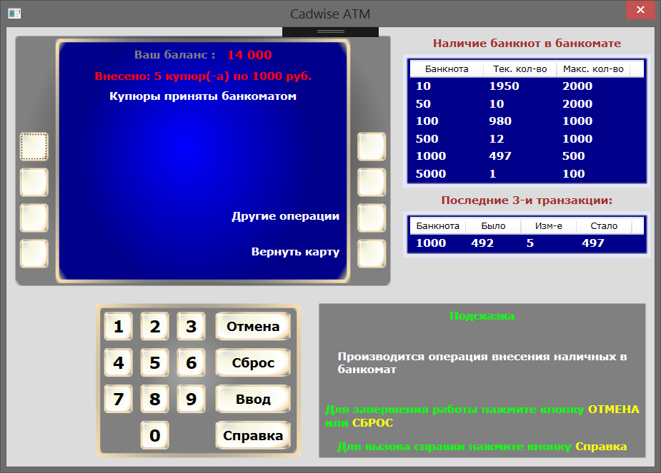
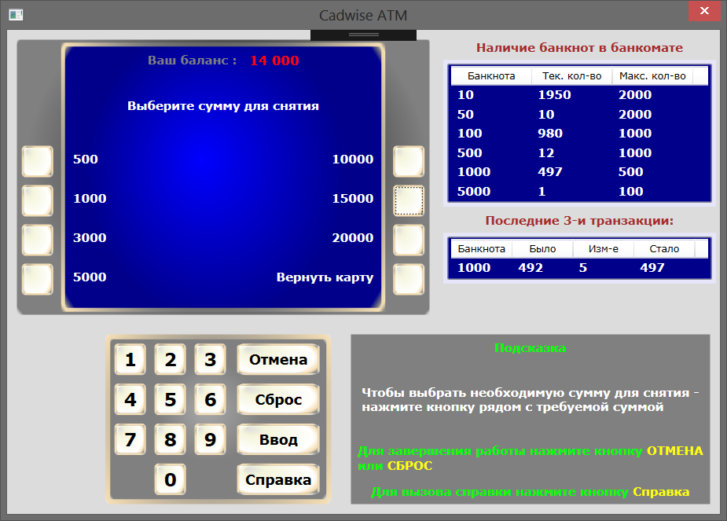
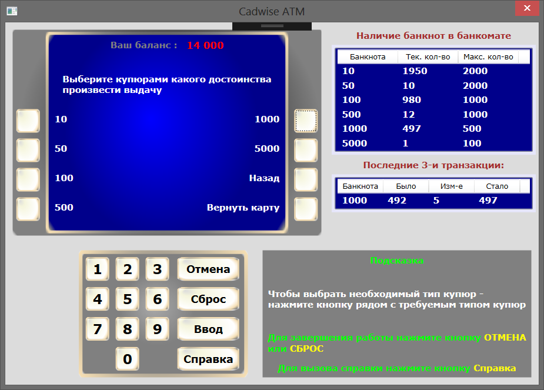

# WPF_CadwiseATM
Windows Desktop Application made on WPF & C# for emulate ATM

This is an example of WPF application that sevres as ATM emulator with included help system

Take a look: 

Code: 
<ul>
	<li><a href="Code/Banknote.cs">Banknote.cs</a>,</li>
	<li><a href="Code/Cardholder.cs">Cardholder.cs</a>,</li>
	<li><a href="Code/GifImage.cs">GifImage.cs</a>,</li>
	<li><a href="Code/HelpWindow.xaml.cs">HelpWindow.xaml.cs</a>,</li>
	<li><a href="Code/LastTransInfo.cs">LastTransInfo.cs</a>,</li>  
  <li><a href="Code/MainWindow.xaml.cs">MainWindow.xaml.cs</a>,</li>
	<li><a href="Code/ScreenInfo.cs">ScreenInfo.cs</a>.</li>
</ul>

XAML:
<ul>
	<li><a href="XAML/HelpWindow.xaml">HelpWindow.xaml</a>,</li>
	<li><a href="XAML/MainWindow.xaml">MainWindow.xaml</a>.</li>
</ul>

Here are some screenshjots of ATM windows that display for user:
 

 

 

 

